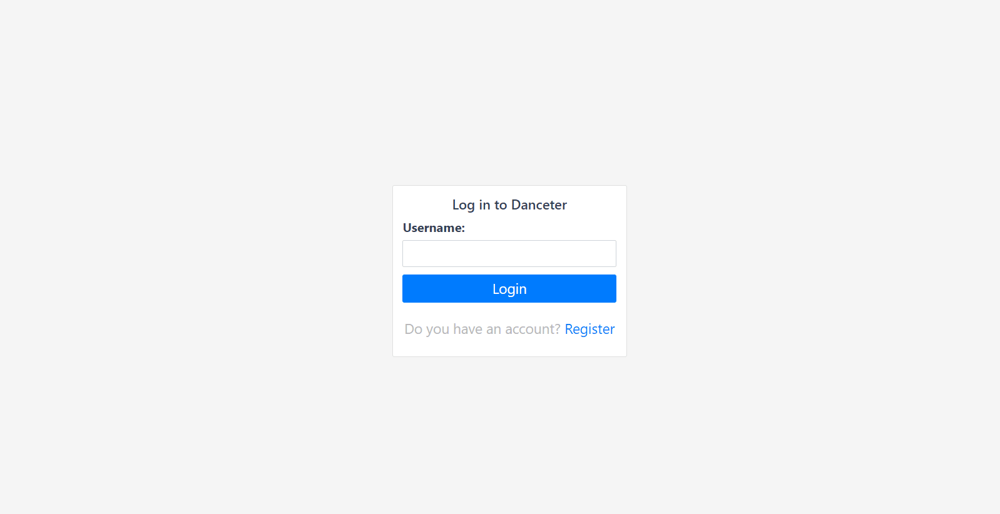

# Ruby on Rails Capstone Project: Redesign of Twitter

> In this project I built Dance opinion application based on a redesign of Twitter.  

Some of the advanced concepts explored in this project includes.
- Working with advanced associations, many-to-many relationships, a typical twitter follow and follower relationship model.
- Basic Authentication using just username
- Used RSpec as the test suit with the help of shoulda-matchers and capybara for effective testing. Both unit and integration testing was done.
 




## Built With

- Ruby v2.7.1
- Ruby on Rails v6.0.3.4
- RSpec
- Bootstrap ~4.0

## Live Demo

[Live Demo](https://danceter.herokuapp.com/)

## Video Presentation

[Video Link](https://youtu.be/PLhU1zXu0uU )


## Getting Started

To get a local copy up and running follow these simple example steps.

### Prerequisites

Ruby: 2.7.1
Rails: 6.0.3.4
Postgres: >=9.5

### Setup

~~~bash
$ git clone https://github.com/vmwhoami/danceter
$ cd danceter
~~~

Install gems with:

```
bundle install
```

Setup database with:

> make sure you have postgress sql installed and running on your system

```
   rails db:create
   rails db:migrate
```

### Usage

Start server with:

```
    rails server
```

Open `http://localhost:3000/` in your browser.

### Run tests

```
    rpsec 
```

# Authors

👤 **Vitalie Melnic**

- Github: [@vmwhoami](https://github.com/vmwhoami)
- Twitter: [@vmwhoami](https://twitter.com/vmwhoami)
- Linkedin: [vitalie-melnic](https://www.linkedin.com/in/vitalie-melnic/)


## 🤝 Contributing

Contributions, issues and feature requests are welcome!

Feel free to check the [issues page](issues/).

## Show your support

Give a ⭐️ if you like this project!

## Acknowledgments

- Microverse
- Design idea by [Gregoire Vella on Behance](https://www.behance.net/gregoirevella)  |  [Behance Design](https://www.behance.net/gallery/14286087/Twitter-Redesign-of-UI-details)
